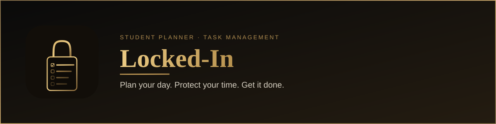
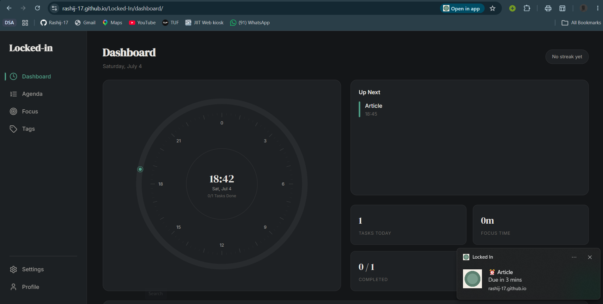
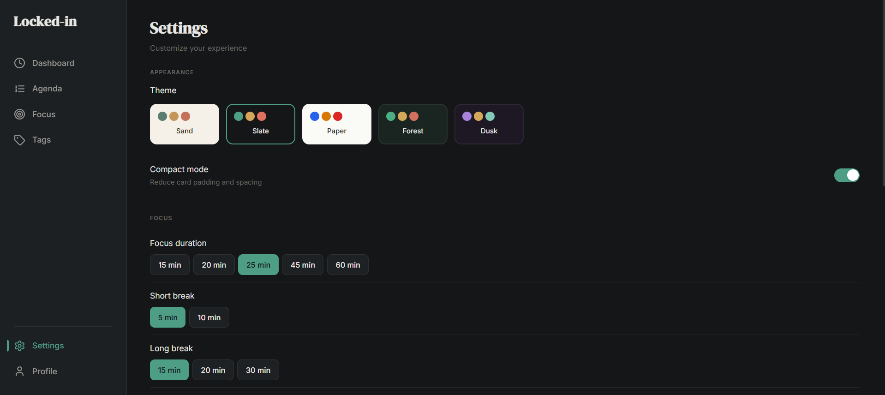
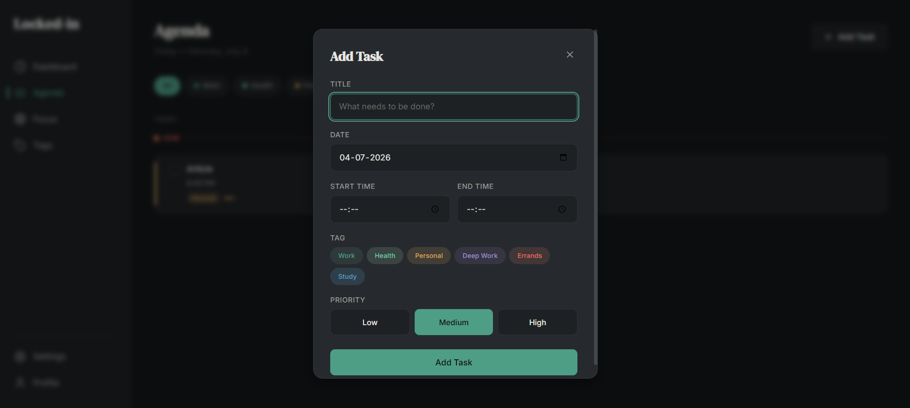

<div align="center">
  
</div>
<br>
<br>
<div align="center">


<br>
<sub>
  <a href="https://rashij-17.github.io/Locked-In/"><b>Go check for your self ! </b></a>
  &nbsp;·&nbsp;
  <a href="#features"><b>FEATURES</b></a>
  &nbsp;·&nbsp;
  <a href="#installing-as-an-app"><b>INSTALL</b></a>
  &nbsp;·&nbsp;
  <a href="#stack"><b>STACK</b></a>
</sub>

</div>

<br />

> Most productivity apps shout at you — streak flames, confetti, neon progress bars. **Locked-In** does the opposite. It borrows its calm from analog stationery: soft paper tones, muted ink, one gentle accent colour. The goal isn't to gamify your day. It's to get out of the way of it.

<br />

## Preview

<div align="center">
  
  <sub><i>Dashboard — a radial clock, today's agenda, and focus metrics in one glance</i></sub>
  <br /><br />
  
  <sub><i>Settings — five muted, low-stimulus themes: Sand, Slate, Paper, Forest, Dusk</i></sub>
  <br /><br />
  
  <sub><i>Agenda — quick task capture with tags, priority, and scheduling</i></sub>
</div>

<br />

## Features

|  |  |
|---|---|
| **Radial dashboard** | A clock-face overview of the day — streaks, tasks, and focus time at a glance |
| **Desktop reminders** | Native OS notifications fire before a task is due, even in a background tab |
| **Installable PWA** | Add it to your dock or home screen; it opens standalone, with its own icon and window |
| **Fully responsive** | One layout, tuned for desktop, tablet, and phone alike |
| **Focus mode** | A breathing Pomodoro timer with slow, low-contrast background transitions |
| **Curated themes** | Five tonal palettes — Sand, Slate, Paper, Forest, Dusk — swap instantly |
| **Tagging & priority** | Work, Health, Personal, Deep Work, Errands, Study — sorted at a glance |
| **Offline-first** | Local caching keeps it instant; Supabase/Firebase sync is optional, not required |

<br />

## Installing as an app

Locked-In is a **Progressive Web App** — no store, no install wizard, just your browser.

**Desktop (Chrome / Edge)**
1. Open the [live demo](https://rashij-17.github.io/Locked-In/)
2. Click the install icon in the address bar
3. It now launches from your dock or taskbar in its own window — and can send you desktop reminders even when it isn't open

**Mobile (iOS / Android)**
1. Open the live demo in your browser
2. Choose **Add to Home Screen**
3. Launch it like any other app on your device

<br />

## Stack

<a name="stack"></a>

| Layer | Choice |
|---|---|
| Framework | Next.js 14 (App Router) |
| State | Zustand |
| Styling | Custom design tokens — no default UI kit |
| Auth / Sync | Firebase Auth · Supabase |
| Offline & reminders | Service Worker + Web App Manifest |
| Deployment | GitHub Pages, static export |

<br />

## Getting started

```bash
git clone https://github.com/Rashij-17/Locked-In.git
cd Locked-In
npm install
npm run dev
```

Then open **localhost:3000**. Build for production with `npm run build`.

<br />

## Roadmap

- [ ] Recurring tasks
- [ ] Cross-device sync
- [ ] Weekly review view
- [ ] Custom theme builder

<br />

<div align="center">
  <sub>Designed &amp; built by <a href="https://github.com/Rashij-17"><b>Rashi Johari</b></a></sub>
  <br />
  <sub>If the aesthetic resonates, a star is always appreciated.</sub>
</div>
